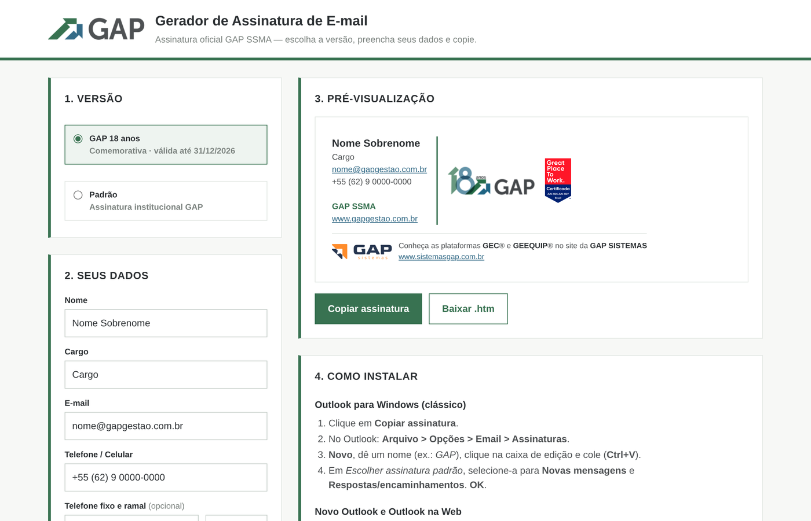

<div align="center">

# Gerador de Assinatura de E-mail · GAP SSMA

Ferramenta oficial para criar a assinatura de e-mail padronizada da **GAP SSMA**, pronta para colar no Outlook e no Gmail.

[](https://gap-ssma.github.io/gap-assinatura-email/)
[](#changelog)
[](#compatibilidade-com-e-mail)

### 👉 [Abrir o gerador](https://gap-ssma.github.io/gap-assinatura-email/)

**https://gap-ssma.github.io/gap-assinatura-email/**

</div>

---



## Sumário

- [Versões disponíveis](#versões-disponíveis)
- [Trabalho em cliente](#trabalho-em-cliente)
- [Como usar](#como-usar)
- [Instalação no cliente de e-mail](#instalação-no-cliente-de-e-mail)
- [Como adicionar uma nova versão](#como-adicionar-uma-nova-versão)
- [Compatibilidade com e-mail](#compatibilidade-com-e-mail)
- [Privacidade](#privacidade)
- [Estrutura do repositório](#estrutura-do-repositório)
- [Changelog](#changelog)

## Versões disponíveis

| Versão | Identificador | Validade | Observação |
|---|---|---|---|
| **GAP 18 anos** | `18anos` | até **31/12/2026** | Comemorativa dos 18 anos da GAP · **selecionada por padrão** |
| **Padrão** | `padrao` | sem prazo | Assinatura institucional com o logotipo GAP |

As duas versões trazem o selo **Great Place to Work® Certificada (Jun/2026–Jun/2027)** e o rodapé da **GAP Sistemas**.
Após o fim da validade, a versão comemorativa aparece como *expirada* e a **Padrão** passa a ser a sugerida.

Link direto para uma versão: [`?versao=18anos`](https://gap-ssma.github.io/gap-assinatura-email/?versao=18anos) ·
[`?versao=padrao`](https://gap-ssma.github.io/gap-assinatura-email/?versao=padrao)

## Trabalho em cliente

Colaboradores alocados em parceiros podem usar o layout **em cliente**, com identificação da GAP e do cliente na mesma assinatura:

- **Contato** (nome, cargo, e-mail e telefones) no topo.
- Abaixo, **duas colunas** separadas por linha cinza:
  - **Empresa: GAP SSMA** + logotipo GAP (e selo GPTW, conforme a versão escolhida).
  - **A serviço de:** nome do cliente, unidade (opcional) e logotipo enviado pelo colaborador.

O logo do cliente é recortado (margens claras), ajustado (até 150×45 px) e **embutido na assinatura** (não vai para `assets/`). O layout em cliente **não** inclui selo GPTW nem rodapé GAP Sistemas. Use **Baixar logo** se o Outlook ou o Gmail não exibirem a imagem ao colar. Se a opção não estiver marcada ou faltar empresa/logo, a assinatura permanece **igual à versão institucional** (colunas GAP + selo).


Parâmetros opcionais na URL: `cliente=1`, `cliente_empresa=...`, `cliente_unidade=...` (o logo continua sendo enviado pelo formulário).

## Como usar

1. Acesse **https://gap-ssma.github.io/gap-assinatura-email/**.
2. Em **1. Versão**, escolha a assinatura (*GAP 18 anos* ou *Padrão*).
3. Em **2. Seus dados**, preencha **Nome**, **Cargo**, **E-mail** e **Telefone/Celular**.
   *Telefone fixo e ramal* são opcionais: campos em branco não aparecem na assinatura.
4. *(Opcional)* Em **3. Trabalho em cliente**, marque a opção, informe a empresa/unidade e envie o **logotipo do parceiro**.
5. Confira o resultado em **4. Pré-visualização**.
6. Clique em **Copiar assinatura** e cole no seu cliente de e-mail (veja abaixo).
   Alternativa para o Outlook clássico: **Baixar .htm**.

## Instalação no cliente de e-mail

### Outlook para Windows (clássico)

1. No gerador, clique em **Copiar assinatura**.
2. No Outlook, acesse **Arquivo › Opções › Email › Assinaturas…**
3. Clique em **Novo**, dê um nome (ex.: *GAP*), clique na caixa de edição e cole com **Ctrl+V**.
4. Em *Escolher assinatura padrão*, selecione-a para **Novas mensagens** e **Respostas/encaminhamentos** e clique em **OK**.

> **Alternativa (.htm):** clique em **Baixar .htm**, pressione **Win+R**, digite `%APPDATA%\Microsoft\Signatures`,
> mova o arquivo para essa pasta e reinicie o Outlook.

### Novo Outlook e Outlook na Web

1. No gerador, clique em **Copiar assinatura**.
2. Abra **Configurações** (ícone de engrenagem) › **Contas** › **Assinaturas** › **+ Nova assinatura**.
3. Cole com **Ctrl+V**, defina como padrão para novas mensagens e respostas e clique em **Salvar**.

### Gmail

1. No gerador, clique em **Copiar assinatura**.
2. No Gmail, clique na engrenagem › **Ver todas as configurações** › aba **Geral** › **Assinatura** › **Criar nova**.
3. Cole com **Ctrl+V**, selecione-a em *Padrões de assinatura* e clique em **Salvar alterações** no fim da página.

> **Dica:** use sempre **Ctrl+V** (colar com formatação). "Colar somente texto" remove os logotipos e o layout.

## Como adicionar uma nova versão

Toda a configuração fica no início do `<script>` em [`index.html`](index.html).

1. **Imagem:** adicione o PNG em `assets/`, com o **dobro** do tamanho de exibição (ex.: 256×86 px para exibir em 128×43).
2. **Registro da imagem:** inclua-a no objeto `IMAGENS`:
   ```js
   gap_campanha: { arquivo: "gap_campanha.png", w: 128, h: 43, alt: "GAP Campanha 2027" },
   ```
3. **Versão:** acrescente um item ao array `VERSOES`:
   ```js
   { id: "campanha2027", label: "Campanha 2027", descricao: "Válida em 2027",
     logo: "gap_campanha", selo: "selo_gptw", validaDe: "2027-01-01", validaAte: "2027-12-31",
     destaque: true, template: "colunas" }
   ```
   | Campo | Descrição |
   |---|---|
   | `id` | Identificador único (também usado em `?versao=`) |
   | `label` / `descricao` | Textos exibidos no seletor |
   | `logo` / `selo` | Chaves do objeto `IMAGENS` (`selo: null` remove o selo) |
   | `validaDe` / `validaAte` | Período de validade `AAAA-MM-DD` (opcionais) |
   | `destaque` | `true` = selecionada por padrão enquanto válida |
   | `template` | Layout, chave do objeto `TEMPLATES` (atualmente `colunas`) |
4. Faça o commit na branch `main`. O GitHub Pages publica a atualização em cerca de 1 minuto.

**Atualizar o selo GPTW:** substitua `assets/selo_gptw.png` mantendo o **mesmo nome** e a proporção (76×130 px).
Assinaturas já instaladas passam a exibir o selo novo automaticamente.

> ⚠️ **Não renomeie, mova ou apague arquivos de `assets/`.** As assinaturas instaladas carregam os logotipos desses
> endereços; alterá-los quebra as imagens nas assinaturas existentes.

## Compatibilidade com e-mail

A assinatura gerada segue as boas práticas de HTML para e-mail, testadas para Outlook (Windows, novo e Web), Gmail,
webmails (ex.: Locaweb) e celulares:

- **Imagens em PNG, nunca SVG:** Outlook e Gmail não exibem SVG. O selo GPTW, publicado em SVG no site, foi convertido para PNG.
- **Imagens hospedadas** neste GitHub Pages (`https://gap-ssma.github.io/gap-assinatura-email/assets/`), em resolução 2× para telas retina.
  Imagens embutidas em base64 são removidas pela maioria dos clientes de e-mail.
- **Layout em tabelas** (`<table>`), sem flexbox/grid, sem CSS externo.
- **Estilos inline** em cada elemento, com ajustes para o Outlook (`mso-line-height-rule`, `mso-table-lspace`).
- **Fontes seguras:** Arial, Helvetica, Segoe UI. Não usa fontes web.
- Sem sombras, cantos arredondados ou efeitos que o Outlook não renderiza.
- Texto real (selecionável e copiável), com `alt` em todas as imagens.

Se o destinatário bloquear imagens externas, os logotipos aparecem depois que ele clica em *baixar imagens*.
O texto da assinatura fica sempre visível.

## Privacidade

- O gerador roda **inteiramente no navegador**: é uma única página HTML estática, sem servidor, banco de dados ou login.
- **Nenhum dado é armazenado ou enviado.** Nome, cargo, e-mail e telefones ficam apenas na aba aberta e somem ao fechá-la.
- Não há cookies, rastreamento nem analytics. As únicas requisições externas são os logotipos de `assets/`.

## Estrutura do repositório

```
├── index.html          # Gerador (versões, formulário, pré-visualização, copiar e baixar)
├── assets/
│   ├── gap_18anos.png  # Selo GAP 18 anos
│   ├── gap_logo.png    # Logotipo GAP (versão Padrão)
│   ├── selo_gptw.png   # Selo Great Place to Work 2026–2027
│   └── gap_sistemas.png# Logotipo GAP Sistemas
├── docs/
│   ├── preview.png              # Imagem deste README
│   └── exemplo-logo-cliente.png # Exemplo para testar upload no layout em cliente
└── .nojekyll           # Publicação direta no GitHub Pages
```

## Changelog

### v1.1.0 · 02/10/2026

- Layout opcional **Trabalho em cliente** (logo e identificação do parceiro).
- Upload de imagem com ajuste automático de tamanho; logo embutido na assinatura copiada/baixada.
- Assinatura institucional inalterada quando a opção não é usada.

### v1.0.0 · 01/10/2026

- Primeira versão publicada do gerador.
- Versões **GAP 18 anos** (válida até 31/12/2026, padrão) e **Padrão**.
- Selo **Great Place to Work® Certificada Jun/2026–Jun/2027** em PNG 2×.
- Botões **Copiar assinatura** (HTML formatado, com alternativa para navegadores antigos) e **Baixar .htm**.
- Instruções para Outlook clássico, novo Outlook/Outlook Web e Gmail.
- Logotipos hospedados no GitHub Pages, com cópia embutida para uso sem internet.

---

<div align="center">

**GAP SSMA** · Saúde, Segurança e Meio Ambiente<br>
[www.gapgestao.com.br](http://www.gapgestao.com.br/) · [www.sistemasgap.com.br](http://www.sistemasgap.com.br/)

</div>
